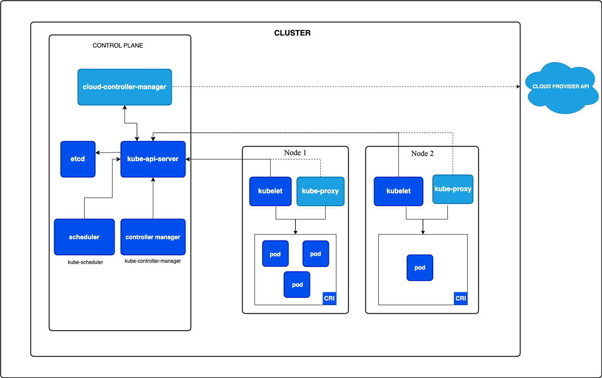

# Kubernetes

1. **What is Kubernetes?**

Open source container orchestration tool to manage the container. It helps in automating deployment, auto scaling, self-healing, load balancing etc.

2. **Core components of K8S**

**Control plane or master Node**

Makes global decision about the cluster (for example scheduling, as well as detecting and responding to cluster events)

1. **kube-api-server** :  api-gateway for the cluster
2. **etcd** : key/value storage, store cluster state and configuration
3. **kube-scheduler**: assign pods to node based on availabilty of resources
4. **kube-controller-manager**: run controllers like node controller, replication controller etc. 

**Worker Node**
1. **kubelet**: runs on each node, responsible for running and managing containers
2. **kube-proxy**: hanldes networking and routes traffice between services

3. **K8S Architecture**



Follows *master* and *worker* architecture. Control plane manages cluster operations while worker nodes run containerized applications.


Kuberenetes continuously monitor and adjust workloads based on the desired state


4. **What is a pod in k8s?**

Pod is the smallest deployable unit in k8s. Represents one or more containers running in shared environments. Containers inside a pod share networking and storage resources.

```yaml
apiVersion: v1
kind: Pod
metadata:
  name: web-server
spec:
  containers:
  - name: nginx-container
    image: nginx:1.21
    ports:
    - containerPort: 80
```

5. **Purpose of kubectl**

It is a cli tool for managing k8s resoruces and interacting with cluster.

```bash
kubectl get nodes
kubect get pods
kubectl logs <pod-name>
kubectl exect -it <pod-name> - /bin/sh
```

6. **Deployment in k8s**

Deploument is a higher-level abstraction that manages the lifecycle of pods. Ensured that the desired number of replicas are up and running and provides features like rolling updates, rollbacks and self-healing

```yaml
apiVersion: apps/v1
kind: Deployment
metadata:
  name: nginx-deployment
spec:
  replicas: 3
  selector:
    matchLabels:
      app: nginx
  template:
    metadata:
      labels:
        app: nginx
    spec:
      containers:
      - name: nginx
        image: nginx:1.21
        ports:
        - containerPort: 80
```

**USe Case**

The following are typical use cases for Deployments:

- **Create a Deployment to rollout a ReplicaSet**. The ReplicaSet creates Pods in the background. Check the status of the rollout to see if it succeeds or not.
- **Declare the new state of the Pods by updating the PodTemplateSpec of the Deployment**. A new ReplicaSet is created and the Deployment manages moving the Pods from the old ReplicaSet to the new one at a controlled rate. Each new ReplicaSet updates the revision of the Deployment.
- **Rollback to an earlier Deployment revision if the current state of the Deployment is not stable**. Each rollback updates the revision of the Deployment.
- **Scale up the Deployment to facilitate more load**.
- **Pause the rollout of a Deployment to apply multiple fixes to its PodTemplateSpec and then resume it to start a new rollout.**
- Use the status of the Deployment as an indicator that a rollout has stuck.
- Clean up older ReplicaSets that you don't need anymore.


7. **K8s Service and why it is needed?**

Service is in k8s exposed a groupd of pods and allows communication between and to them.

Since pods ephermal(doesnot last long), theirs ips keeps on chaning, meaning the application talking to pods must also change the ip address. Services helps to privde a stable network endpoint with a fixed ip address.

```yaml
apiVersion: v1
kind: Service
metadata:
  name: my-service
spec:
  selector:
    app: my-app
  ports:
    - protocol: TCP
      port: 80
      targetPort: 80
  type: ClusterIP
```

8. **Different service types in k8s services**

1. **ClusterIP** : allows for internal commiunction of pods. only accessible within the cluster
2. **NodePort** : exposes serviec on a static port of each node, making it accessible from outside the cluster. Range **30000-32767**
3. **Loadbalancer** : uses a cloud provider's external load balancer. the service is then accessible via a public IP.
4. **ExternalName** : maps a k8s service to external hostname

9. **Configmap and secret**

Configmap maps stores non-sensitive configuration data, while secrets stores sensitive data like api keys, jwt secret, db password, s3 secret key.


**configmap**

```yaml
apiVersion: v1
kind: ConfigMap
metadata:
  name: my-config
data:
  app_name: "Devops"
```

**Secret**

```yaml
apiVersion: v1
kind: Secret
metadata:
  name: my-secret
type: Opaque
data:
  password: cGFzc3dvcmQ=  # "password" encoded in Base64
```

**Benefit of mounting secret as volume vs environmental variable**

1. **Reduced Exposure** : typically stored in-memory within the container and are not exposed as environment variables,which can be easily inspected by othter processes within the container**
2. **Dyanmic Updates** : Secrets mounted as volumes can be updated dynamically without required a pod restart
3. **Supports complex data** : SSL Certificate, multi line strings, etc

10. **Namespace in k8s**

Virtual cluster within a kubernetes cluster. helps to organize worlkloads in multi-tenant enviornments by isolating resources within a cluster.

```bash
kubectl create ns <ns>
kubectl get ns
kubectl get pods -n ns
```

11. **What are labels and selectors**

Labels are key/value pairs attached to objects (e.g.g pods). Help to organize k8s objects. Selector filters resources based on labels..

```yaml

apiVersion: v1
kind: Pod
metadata:
  name: my-pod
  labels:
    environment: production
    app: nginx
spec:
  containers:
  - name: nginx-container
    image: nginx:1.21
    ports:
    - containerPort: 80
```

```bash
kubectl get pods -l environment=production
```

12. **Persistent Volumes (PVs) and Persistent Volumen Claims (Pvc)?**

Persistent volume provids storage that persist beyon pod lifecycle.

PV is a storage piece in the cluster that is provisoned by Cluster admin or dynamically provisioned using storage class

PVC is a request for storabe by a user


```yaml
apiVersion: v1
kind: PersistentVolume
metadata:
  name: my-pv
spec:
  capacity:
    storage: 1Gi
  accessModes:
    - ReadWriteOnce
  persistentVolumeReclaimPolicy: Retain
  hostPath:
    path: "/mnt/data"
```

```yaml
apiVersion: v1
kind: PersistentVolumeClaim
metadata:
  name: my-pvc
spec:
  accessModes:
    - ReadWriteOnce
  resources:
    requests:
      storage: 1Gi
```

13. **Kubernetes networking and how does it work**

Networking allows communication between services, pods and external clients. By default all pods can communicate with each other.

**key networking concept**

* pod-to-pod communication : each pod gets a unique IP assigned and can communicate within the cluster
* service-to-pod communication : srvices provide a stable network endpoijnt for a group of pods, as pods are ephermal. each pod gets a new IP assigned every time it is created
* ingress controllers: manage external HTTP/HTTPS traffic
* Network policies : define rules to restrict or allow communication between pods

## Network Policies

Control traffic flow at the IP address or port level (OSI layer 3 or 4), network policies allow to specify rules for traffic flow within your cluster, and also between pods and the outside workd.

```yaml
apiVersion: networking.k8s.io/v1
kind: NetworkPolicy
metadata:
  name: test-network-policy
  namespace: default
spec:
  podSelector:
    matchLabels:
      role: db
  policyTypes:
  - Ingress
  - Egress
  ingress:
  - from:
    - ipBlock:
        cidr: 172.17.0.0/16
        except:
        - 172.17.1.0/24
    - namespaceSelector:
        matchLabels:
          project: myproject
    - podSelector:
        matchLabels:
          role: frontend
    ports:
    - protocol: TCP
      port: 6379
  egress:
  - to:
    - ipBlock:
        cidr: 10.0.0.0/24
    ports:
    - protocol: TCP
      port: 5978
```

14. **Role-based access control**

Security mechanism that restrics users and servics based on their permissions. Consists of

- Roles and ClusterRoles : define the actions allowed on Resources
- RoleBindings and ClusterRoleBinding : assign roles to user or service accounts


## ClusterRoleBinding Vs RoleBinding

ClusterRoleBinding bind permission cluster-wide (user or user groups)
RoleBinding bind permission to specific namespace

**role**

```yaml
apiVersion: rbac.authorization.k8s.io/v1
kind: Role
metadata:
  name: pod-reader
rules:
  - apiGroups: [""]
    resources: ["pods"]
    verbs: ["get", "watch", "list"]
```

**rolebinding**

```yaml
apiVersion: rbac.authorization.k8s.io/v1
kind: RoleBinding
metadata:
  name: pod-reader-binding
subjects:
  - kind: User
    name: dummy
roleRef:
  kind: Role
  name: pod-reader
  apiGroup: rbac.authorization.k8s.io
```

**clusterrolebinding**

```yaml
apiVersion: rbac.authorization.k8s.io/v1
kind: ClusterRoleBinding
metadata:
  name: admin-access
subjects:
  - kind: User
    name: "super-user"
    apiGroup: rbac.authorization.k8s.io
roleRef:
  kind: ClusterRole
  name: "cluster-admin"
  apiGroup: rbac.authorization.k8s.io
```

15. **how does autoscaling works**

Two ways to autoscale in k8s

1. **Horizontal Pod Autoscaler(HPA)** : adjusts the number of pods based on CPU usage, memory usage,or custom metrics
2. **Vertical Podscaler (VPA)**: adjusts the cpu and memory requests for individual pods
3. **Cluster Autoscaler**: Adjusts the number of worker nodes in the cluster based on resource needs

```bash
kubectl autoscale deployment nginx --cpu-percent=50 --min=1 --max=10
```
16. **debugging kubernetes pods**

```bash
kubectl logs <pod-name>
kbuectl describe pod <pod-name>
kubectl exec -it <pod-name> - /bin/sh
kubectl get pods 
```